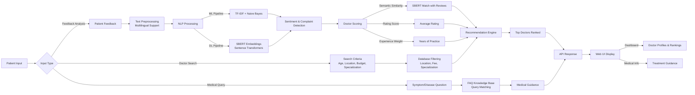
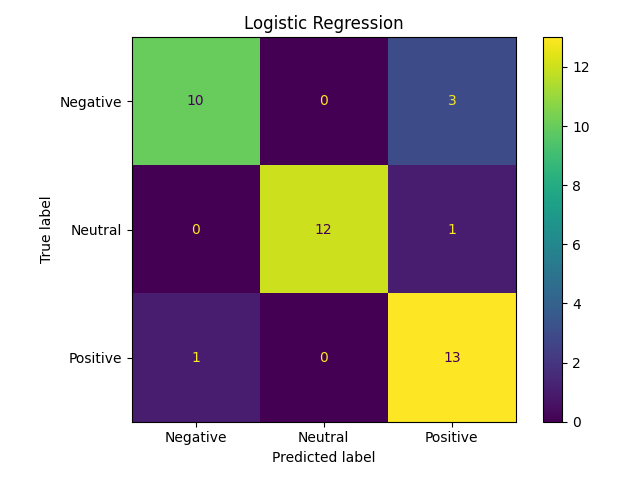
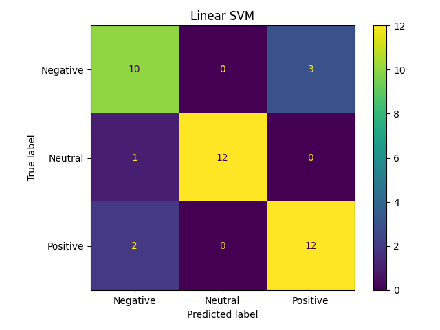
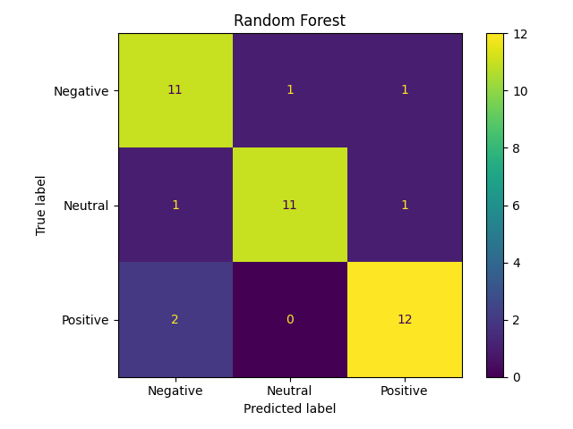
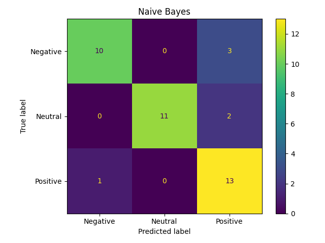
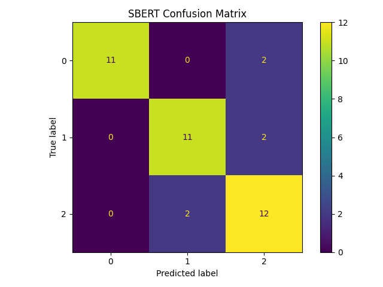
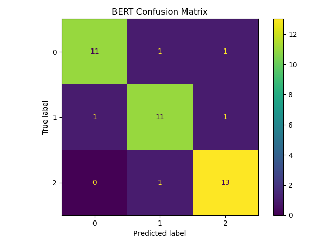
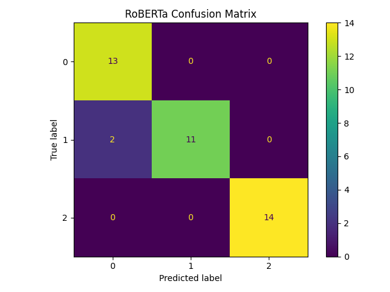
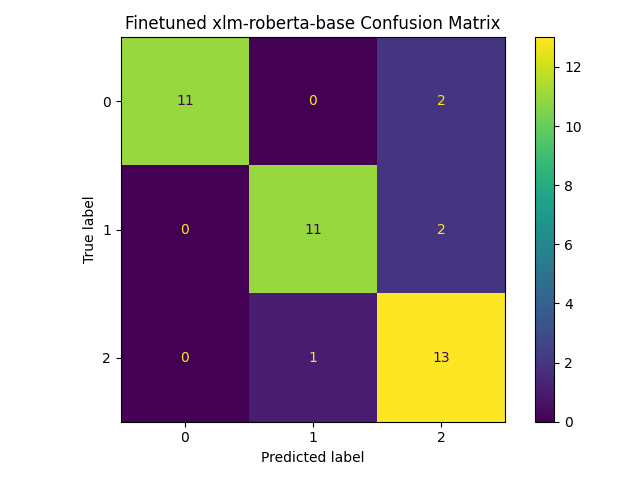

# PATIENT FEEDBACK-BASED HEALTHCARE RECOMMENDATION
## 1. Problem Statement

Patients often struggle to find the right doctor or specialist because healthcare information is scattered across reviews, ratings, consultation fees, waiting times, and treatment quality. Traditional systems rely only on basic star ratings and do not effectively interpret natural language patient feedback.

This project builds an **NLP-based healthcare recommendation system** that:
- Analyzes patient feedback written in natural language
- Detects sentiment (positive/negative/neutral) and complaint categories (fees, waiting time, behavior, treatment quality)
- Recommends doctors and specialists based on semantic similarity, ratings, experience, location, and budget constraints
- Supports multilingual feedback processing (Tamil, Hindi, Telugu, Kannada, Malayalam, English)
- Provides AI-powered medical query assistance for symptom guidance

The goal is to combine classical ML (TF-IDF + sklearn) with modern deep learning (SBERT embeddings) for intelligent doctor discovery.

## 2. Pipeline Diagram



## 3. Dataset Details

### 3.1 Doctor Dataset
- **File:** `dataset.csv`
- **Format:** CSV with headers
- **Key columns:**
  - `doctor_id`: Unique doctor identifier
  - `doctor_name`: Full name
  - `specialization`: Medical specialty (Cardiology, ENT, Dermatology, etc.)
  - `consultation_fee`: Consultation cost in rupees
  - `average_rating`: Patient rating (1-5 stars)
  - `experience_years`: Years of medical practice
  - `location`: Hospital/clinic location
  - `feedback_text`: Patient review text
  - `sentiment_label`: Classified as Positive/Negative/Neutral
  - `complaint_category`: Issue type (Fees/Waiting/Behaviour/Treatment/General)

### 3.2 Feedback Classification Dataset
- **Source file:** `dataset.csv` (feedback_text + sentiment_label columns)
- **Sentiment classes:** Positive, Negative, Neutral
- **Complaint categories:** Waiting, Fees, Behaviour, Treatment, General
- **Used for:** Training SBERT embeddings and TF-IDF models

### 3.3 FAQ/Medical Query Dataset
- **File:** `faq.csv`
- **Columns:** question, answer, keywords
- **Purpose:** Provide AI medical guidance for common symptoms and conditions

### 3.4 Processed Outputs
- `outputs/processed_tabular.csv`
- `phase2_outputs/processed_dataset.csv`
- `phase2_outputs/summary.json`
 

## 4. Model Details (ML + DL)

### 4.1 ML Models Used
- **Feature Extraction:** TF-IDF Vectorizer (max_features=5000)
- **Baseline Algorithms:**
  - Logistic Regression
  - Support Vector Machine (SVM)
  - Naive Bayes
  - Random Forest
- **Selection Criterion:** Best test-set accuracy on sentiment + complaint classification

### 4.2 Response/Recommendation Generation
- **Approach:** Semantic similarity-based retrieval
- **Method:** TF-IDF + Cosine Similarity between user feedback and doctor reviews
- **Scoring:** Multi-factor ranking combining rating, semantic match, experience, location

### 4.3 Deep Learning Models Used
- **Text Embeddings:** Sentence-Transformers (SBERT)
  - Primary: `paraphrase-multilingual-MiniLM-L12-v2` (faster)
  - Advanced: `bert-base-multilingual-uncased` (104-language support)
- **Emotion/Sentiment Classification:** Uses SBERT embeddings + Logistic Regression
- **Language Detection:** `langdetect` for automatic language identification
- **Translation Support:** `deep-translator` / `googletrans` for multilingual queries

### 4.4 Speech and Voice Components
- **Speech-to-Text:** Planned integration with OpenAI Whisper (optional)
- **Voice Cloning:** Planned Coqui XTTS v2 support (optional)

## Features
- Doctor, specialist, and hospital recommendation
- NLP-based patient review analysis
- Complaint detection from natural language feedback
- Multilingual feedback support
- Fee-based and location-based filtering
- FAQ-based medical query assistance
- Dashboard, login, enrollment, results, and doctor detail pages

## Required Dependencies / Libraries

Main dependencies used in the project:
- Flask
- pandas
- scikit-learn
- openpyxl
- deep-translator
- sentence-transformers
- torch
- numpy
- langdetect
- googletrans
- google-trans-new

Recommended installation files:
- `requirements.txt`
- `requirements_advanced.txt`

## Steps to Run the Project

### 1. Clone or open the folder
Open the project folder in VS Code:
`ml website project`

### 2. Create and activate a Python environment
Example using virtualenv:
```bash
python -m venv .venv
.venv\Scripts\activate
```

### 3. Install dependencies
For the standard version:
```bash
pip install -r requirements.txt
```

For the advanced SBERT version:
```bash
pip install -r requirements_advanced.txt
```

### 4. Train the advanced model
Run this if you want SBERT-based multilingual doctor matching:
```bash
python train_advanced.py
```

### 5. Start the Flask app
```bash
python app.py
```

### 6. Open the website
Open your browser and visit:
```text
http://localhost:5000
```

## 7. Model Output Pictures

The following picture shows the `model.py` evaluation output.

### 7.1 Evaluation Matrix

Below is a table with the evaluation screenshots generated by `model.py` (files located in `phase2_outputs/`). Each row shows the image and a short description.

| Image | Description |
|------|-------------|
|  | Confusion matrix: Logistic Regression |
|  | Confusion matrix: Linear SVM |
|  | Confusion matrix: Random Forest |
|  | Confusion matrix: Naive Bayes |
|  | Confusion matrix: MLP (Deep Learning) |
|  | Confusion matrix: SBERT-based model |
|  | Confusion matrix: BERT + Logistic Regression |
|  | Confusion matrix: RoBERTa + Logistic Regression |
|  | Confusion matrix: Fine-tuned model |


## 8. Team Member Details

**Batch:** 2024-2025  
**Team Number:** 14  
**Institution:** Kumaraguru College of Technology

| Sr. | Name | Register Number |
|-----|------|-----------------|
| 1 | Paramasivam A | 24BCS198 |
| 2 | Prawin H | 24BCS209 |
| 3 | Rupak Krishna P M | 24BCS231 |
| 4 | Santhosh Krishnaa M | 24BCS245 |

## 9. Project Structure

```
ml website project/
├── Core Scripts (Training & ML)
│   ├── model.py                    # Traditional ML pipeline (TF-IDF + classifiers)
│   ├── sbert_model.py              # Basic SBERT implementation
│   ├── sbert_model_advanced.py     # Advanced SBERT with language detection & translation
│   ├── train_sbert.py              # Basic SBERT training script
│   ├── train_advanced.py           # Advanced training with multilingual support
│   └── model_comparison.py         # Algorithm performance comparison
│
├── Web Application
│   ├── app.py                      # Main Flask application & routing
│   ├── app_sbert_integrated.py     # SBERT-integrated Flask app variant
│   ├── languages.py                # Multilingual support utilities
│   └── test_translation.py         # Translation testing module
│
├── Data Files
│   ├── dataset.csv                 # Main doctor profile dataset
│   ├── faq.csv                     # Medical FAQ knowledge base
│   └── inspect_dataset.py          # Dataset inspection utility
│
├── Frontend
│   ├── static/
│   │   ├── style.css               # Main styling (Glassmorphism theme)
│   │   └── virtual_keyboard.js     # Regional language keyboard support
│   └── templates/
│       ├── base.html               # Template foundation (i18n enabled)
│       ├── home.html               # Homepage with body part selection
│       ├── search_multilingual.html# Doctor search with language switching
│       ├── query.html              # Medical query form
│       ├── results.html            # Doctor recommendation results
│       ├── doctor_detail.html      # Individual doctor profile
│       ├── dashboard.html          # Statistics & top doctors
│       ├── login.html              # Authentication
│       ├── enroll.html             # Patient enrollment
│       ├── forgot_password.html    # Password recovery
│       ├── form.html               # Generic form template
│       ├── map.html                # Hospital location map
│       └── 404.html                # Error page
│
├── Output & Reports
│   ├── outputs/
│   │   └── processed_tabular.csv   # Processed training data
│   ├── phase2_outputs/
│   │   ├── processed_dataset.csv   # Phase 2 processed data
│   │   ├── model_comparison.png    # Algorithm performance comparison (chart)
│   │   ├── summary.json            # Training summary statistics
│   │   └── finetune/
│   │       └── checkpoint-100/     # Fine-tuned model checkpoint
│   └── reports/
│       ├── feature_correlation.csv # Feature correlation analysis
│       └── feature_importance_numeric.csv # Feature importance scores
│
├── Configuration & Documentation
│   ├── requirements.txt            # Basic dependencies (ML only)
│   ├── requirements_sbert.txt      # SBERT dependencies
│   ├── requirements_advanced.txt   # Full stack (ML + DL + translation)
│   ├── README.md                   # This file
│   ├── SETUP_COMPLETE.md           # Setup completion checklist
│   ├── PROJECT_COMPLETE.md         # Project completion summary
│   ├── SBERT_GUIDE.md              # SBERT usage guide
│   ├── COMPARISON_BEFORE_AFTER.md # Performance comparison
│   ├── QUICK_START.txt             # Quick start commands
│   └── QUICK_COMMANDS.txt          # Reference commands
```

## 10. Key Features

1. **Doctor Recommendation Engine**
   - Semantic-based doctor matching using SBERT embeddings
   - Multi-factor ranking (rating, similarity, experience, location, fees)
   - Feedback-aware recommendations

2. **Sentiment & Complaint Analysis**
   - Classify patient feedback as Positive/Negative/Neutral
   - Identify complaint categories (Waiting/Fees/Behaviour/Treatment)
   - ML + DL hybrid approach for robust classification

3. **Multilingual Support**
   - Automatic language detection (Tamil, Hindi, Telugu, Kannada, Malayalam, English)
   - Query translation and multilingual embeddings
   - Regional language virtual keyboard input

4. **Medical Query Assistant**
   - FAQ-based symptom guidance
   - Natural language medical question answering
   - Chatbot-like interface for patient interaction

5. **Advanced Filtering**
   - Location-based doctor search
   - Budget/fee constraints
   - Specialization and experience filtering
   - Rating threshold customization

6. **Dashboard & Analytics**
   - Top-rated doctors visualization
   - Sentiment distribution charts
   - Doctor recommendation statistics

7. **User Management**
   - Patient enrollment and login
   - Personalized doctor recommendations
   - Feedback history tracking

## 11. System Workflow

1. **Patient Enters Query/Symptom** → "I have chest pain"
2. **Language Detection** → Detects as English (or Tamil/Hindi/etc.)
3. **Text Preprocessing** → Tokenization, lemmatization, stopwords removal
4. **NLP Analysis** → TF-IDF + SBERT embeddings
5. **Sentiment Classification** → Classifies as medical concern
6. **Doctor Matching** → SBERT semantic similarity with doctor reviews
7. **Multi-Factor Scoring:**
   - Semantic similarity score
   - Doctor average rating
   - Years of experience
   - Consultation fee (if budget specified)
   - Location (if location specified)
8. **Recommendation** → Ranked list of suitable doctors
9. **UI Display** → Show doctor profiles, ratings, feedback

## 12. Limitations

1. **Dataset Quality:** Recommendation accuracy depends on quality and coverage of doctor dataset
2. **Language Support:** Multilingual translation accuracy varies; some languages may have lower accuracy
3. **SBERT Training:** First-time training can be time-consuming (1-5 minutes depending on dataset size)
4. **Real-time API Constraints:** Translation APIs may have rate limits and latency
5. **Specialization Coverage:** Limited to specializations present in dataset
6. **Appointment System:** Current version does not integrate with real hospital appointment booking systems
7. **Privacy:** Patient feedback requires careful handling for data privacy compliance

## 13. Future Enhancements

1. **Hospital API Integration:**
   - Real-time appointment booking
   - Live availability checking
   - Instant consultation scheduling

2. **Advanced Analytics:**
   - Sentiment trend visualization over time
   - Doctor performance metrics dashboard
   - Patient satisfaction trending

3. **Enhanced Multilingual Support:**
   - Additional languages beyond current 6
   - Better translation models (e.g., Hugging Face translation)
   - Voice input for non-text queries

4. **Patient Follow-up System:**
   - Appointment reminders
   - Post-consultation feedback collection
   - Medical history tracking

5. **AI Chatbot Integration:**
   - Voice-based symptom description (OpenAI Whisper)
   - Interactive diagnostic assistance
   - Medication interaction checking

6. **Appointment & Payment Integration:**
   - Online scheduling system
   - Payment gateway integration
   - Prescription delivery tracking

7. **Performance Optimization:**
   - Redis caching for faster retrieval
   - Database optimization (SQLite → PostgreSQL)
   - API rate limiting and load balancing

## 14. Quick Start Commands

```bash
# Setup
python -m venv .venv
.venv\Scripts\activate  # Windows
source .venv/bin/activate  # Linux/Mac

# Install
pip install -r requirements_advanced.txt

# Train
python train_advanced.py

# Run
python app.py

# Access
# Open browser: http://localhost:5000
```

## 15. Technology Stack Summary

| Component | Technology |
|-----------|------------|
| **Backend Framework** | Flask 2.3.3 |
| **NLP (Traditional ML)** | scikit-learn, TF-IDF |
| **Deep Learning (DL)** | PyTorch, Sentence-Transformers (SBERT) |
| **Data Processing** | pandas, NumPy |
| **Language Detection** | langdetect |
| **Translation** | deep-translator, googletrans |
| **Frontend** | HTML5, CSS3 (Glassmorphism), JavaScript |
| **Database** | CSV (expandable to SQLite/PostgreSQL) |
| **Deployment** | Local Flask (Gunicorn/Nginx ready) |

## 16. References & Resources

- **Sentence-Transformers:** https://www.sbert.net/
- **scikit-learn:** https://scikit-learn.org/
- **Flask Documentation:** https://flask.palletsprojects.com/
- **langdetect:** https://github.com/Mimino666/langdetect
- **deep-translator:** https://github.com/nidhaloff/deep-translator

---
